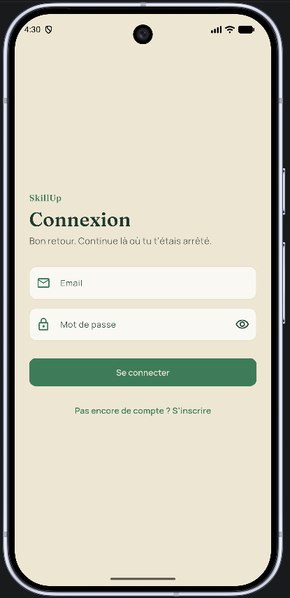
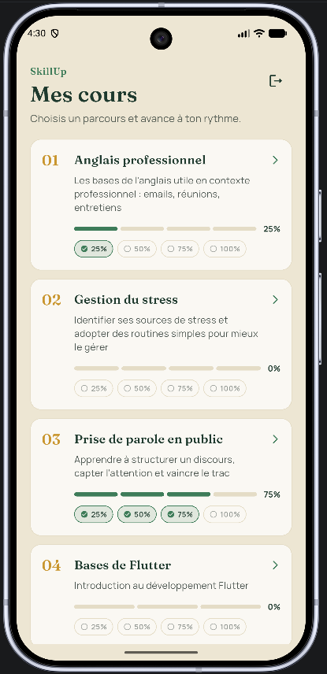
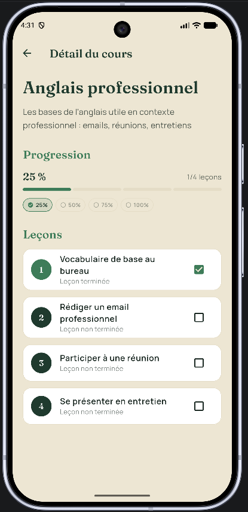

# SkillUp

Application mobile de suivi d'apprentissage — **Flutter Summer Camp 2026, Groupe 32**.

SkillUp permet à un utilisateur de créer un compte, parcourir des cours, cocher les leçons terminées et suivre sa progression (pourcentage + jalons) sur chaque cours, en ligne ou hors connexion.

## Sommaire

- [Fonctionnalités](#fonctionnalités)
- [Captures d'écran](#captures-décran)
- [Stack technique](#stack-technique)
- [Architecture](#architecture)
- [Structure du projet](#structure-du-projet)
- [Modèle de données](#modèle-de-données)
- [Direction artistique](#direction-artistique)
- [Mise en route](#mise-en-route)
- [Tests](#tests)
- [Sécurité Firestore](#sécurité-firestore)
- [Limites connues](#limites-connues--pistes-damélioration)

## Fonctionnalités

- **Authentification** email / mot de passe : inscription, connexion, déconnexion, redirection automatique selon l'état de session, erreurs Firebase traduites en français.
- **Liste des cours** chargée depuis Firestore, avec gestion des états de chargement/erreur/liste vide.
- **Détail d'un cours** : liste des leçons, case à cocher pour marquer une leçon terminée.
- **Suivi de progression** : pourcentage de complétion par cours et jalons (25 % / 50 % / 75 % / 100 %), affichés à la fois dans la liste des cours et sur l'écran détail, sous forme de **chemin d'étapes** (un segment par leçon) plutôt qu'une barre de progression plate.
- **Mode hors-ligne** : toute leçon cochée est écrite immédiatement en local (Hive), puis synchronisée vers Firestore dès que la connexion revient ou qu'un utilisateur se connecte. La progression d'un nouvel appareil est rapatriée depuis Firestore à la connexion.
- **Rafraîchissement automatique** de la liste des cours au retour de l'écran détail (bouton retour de l'app *ou* du navigateur sur le web), sans action manuelle de l'utilisateur.
- **Charte graphique dédiée** (palette forêt/mousse/or/sable, typographies Fraunces/Manrope) — pas de Material 3 par défaut.

## Captures d'écran

| Connexion | Liste des cours | Détail d'un cours |
| --- | --- | --- |
|  |  |  |

## Stack technique

| Domaine | Choix |
| --- | --- |
| Framework | Flutter (Dart SDK `^3.12.2`) |
| Backend | Firebase (Auth, Cloud Firestore) |
| Persistance locale | Hive (`hive`, `hive_flutter`) |
| Détection réseau | `connectivity_plus` |
| Typographie | `google_fonts` (Fraunces, Manrope) |
| Tests | `flutter_test` |

Plateformes ciblées : **Android, iOS, Web** (configuration Firebase générée via FlutterFire CLI, voir `lib/firebase_options.dart`).

## Architecture

Le projet suit une **Clean Architecture** en 4 couches sous `lib/` :

```
domain/          entités métier pures + contrats de repository
                 (aucune dépendance à Flutter, Hive ou Firestore)

data/            implémentations concrètes des contrats domain :
                 modèles (conversion Firestore/Hive ↔ entités),
                 datasources (local / remote), repositories

presentation/    écrans et widgets Flutter

core/            services transverses (connectivité, navigation, thème)
```

Règle appliquée dans tout le projet : les écrans dépendent uniquement des **contrats** du domaine (`ProgressRepository`, `AuthRepository`, `CourseRepository`), jamais directement de Hive ou Firestore.

### Stratégie offline-first

1. Une leçon cochée est écrite **immédiatement** dans la box Hive locale `progress_box`, marquée `pendingSync: true`.
2. `ProgressSyncCoordinator` (démarré dans `main.dart`) écoute la connectivité (`ConnectivityService`) et l'état d'authentification : dès que le réseau revient, ou qu'un utilisateur se connecte, il pousse les entrées en attente vers Firestore (`ProgressRepository.synchronize()`) puis les marque `pendingSync: false`.
3. À la connexion d'un utilisateur, `ProgressRepository.pullFromRemote()` rapatrie sa progression Firestore vers Hive (cas d'un nouvel appareil), sans jamais écraser une modification locale plus récente ou pas encore synchronisée.

### Navigation et rafraîchissement

`lib/core/navigation/route_observer.dart` expose un `RouteObserver` partagé, enregistré sur le `Navigator` racine. L'écran "Liste des cours" l'utilise (`RouteAware.didPopNext`) pour se rafraîchir automatiquement dès qu'il redevient visible — y compris via le bouton "retour" du navigateur sur le web, qui ne déclenche pas toujours un `Navigator.pop()` classique.

## Structure du projet

```
lib/
├── core/
│   ├── connectivity/connectivity_service.dart   # état réseau (connectivity_plus)
│   ├── navigation/route_observer.dart           # RouteObserver partagé
│   └── theme/                                   # AppColors, AppTheme (Material personnalisé)
├── domain/
│   ├── entities/          # Progress, Course, Lesson, AppUser, AuthFailure, CourseProgress
│   └── repositories/      # contrats : ProgressRepository, AuthRepository, CourseRepository
├── data/
│   ├── models/            # conversion entité ↔ Hive / Firestore
│   ├── datasources/       # accès Hive (local) et Firestore (remote)
│   └── repositories/      # implémentations des contrats + ProgressSyncCoordinator
├── presentation/
│   ├── auth/login_screen.dart
│   ├── courses/
│   │   ├── courses_list_screen.dart
│   │   ├── course_detail_screen.dart
│   │   └── widgets/       # CourseTile, CourseProgressBar, MilestonesRow, StepTrail
│   └── progress/progress_scope.dart             # InheritedWidget exposant ProgressRepository
├── firebase_options.dart  # généré par FlutterFire CLI
└── main.dart               # composition root : Hive, Firebase, DI, routing racine

test/
├── domain/course_progress_test.dart             # calcul % + jalons (5 cas)
├── data/progress_repository_impl_test.dart      # offline-first : save/sync/pull (5 cas)
└── widget_test.dart                              # thème SkillUp

firestore.rules            # règles de sécurité Firestore
```

## Modèle de données

**Firestore**

```
courses/{courseId}                              lecture seule pour tout utilisateur connecté
courses/{courseId}/lessons/{lessonId}            écriture réservée au back-office

users/{uid}/courses/{courseId}/progress/{lessonId}   progression privée par utilisateur
```

Les cours/leçons sont un contenu partagé (pas de `uid`), alors que la progression est propre à chaque utilisateur — d'où la séparation des chemins.

**Hive (local)**

- Box `progress_box`, une entrée par leçon, clé `"$courseId::$lessonId"`.
- Modèle `ProgressModel` (`@HiveType(typeId: 0)`) — tout futur `HiveObject` doit réserver un nouveau `typeId`, jamais réutiliser `0`.

**Calcul de progression** (`CourseProgress.compute`) : `(nombre de leçons avec Progress.completed == true / nombre total de leçons) * 100`, avec 4 jalons par défaut (25/50/75/100 %). Une leçon sans entrée de progression connue est considérée comme non terminée. Entité pure, testée indépendamment de Flutter/Hive/Firestore.

## Direction artistique

| Rôle | Couleur |
| --- | --- |
| Fond sombre | Forêt `#1F3A2E` |
| Accent principal | Mousse `#3E7C59` |
| Jalons / succès | Or `#C9962F` |
| Fond clair / cartes | Sable `#EDE6D3` |
| Texte | Encre `#182620` |

- Titres et gros chiffres en **Fraunces**, texte courant en **Manrope** (`google_fonts`).
- Progression et jalons visualisés comme un **parcours** (chemin d'étapes, `StepTrail`), volontairement pas une barre de remplissage continue.
- Pas de Material 3 par défaut : thème entièrement personnalisé dans `lib/core/theme/app_theme.dart`.

## Mise en route

```bash
# 1. Dépendances
flutter pub get

# 2. Configuration Firebase (une fois — génère lib/firebase_options.dart,
#    android/app/google-services.json, etc. Nécessite d'être connecté à
#    un projet Firebase existant ou d'en créer un.)
flutterfire configure

# 3. Génération des adaptateurs Hive (nécessaire après tout changement
#    sur un modèle @HiveType, ex. ProgressModel)
dart run build_runner build --delete-conflicting-outputs

# 4. Lancer l'app (choisir un device avec `flutter devices`)
flutter run
```

Pas de CI configurée dans ce dépôt : `flutter analyze` et `flutter test` sont à lancer manuellement avant de considérer une modification terminée.

## Tests

```bash
flutter analyze              # analyse statique (flutter_lints)
flutter test                 # tous les tests
flutter test test/domain/course_progress_test.dart   # un seul fichier
```

Couverture actuelle : calcul de progression/jalons (`CourseProgress`), logique offline-first (`ProgressRepositoryImpl` : écriture locale, synchronisation, rapatriement), thème SkillUp.

## Sécurité Firestore

Résumé de `firestore.rules` :

- `courses/**` : lecture autorisée pour tout utilisateur **authentifié**, écriture bloquée côté client (contenu géré manuellement/back-office).
- `users/{uid}/**` : lecture/écriture réservées à l'utilisateur dont l'`uid` correspond (`request.auth.uid == uid`).
- Tout chemin non listé est refusé par défaut (pas de règle fourre-tout).

## Limites connues / pistes d'amélioration

- Pas d'indicateur visuel "hors-ligne" dans l'UI — la synchro est silencieuse en arrière-plan.
- Pas d'écran de récupération de mot de passe oublié.
- Pas d'injection de dépendances centralisée : chaque écran instancie directement ses repositories (`CourseRepositoryImpl`, `AuthRepositoryImpl`, etc.), acceptable à cette échelle mais à revoir si le nombre d'écrans augmente.
